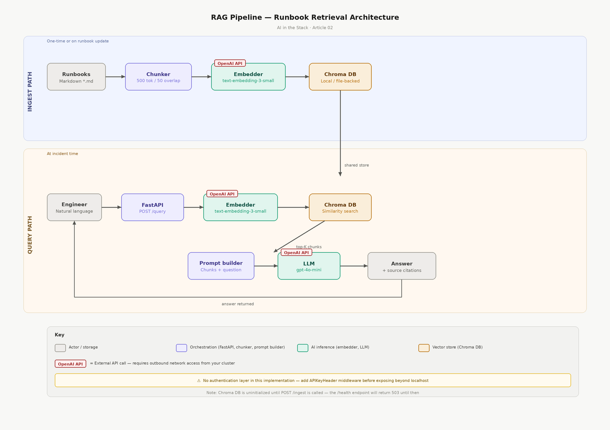

# rag-runbook-assistant

> **Status:** Full walkthrough

A FastAPI service that makes internal runbooks semantically searchable using RAG (Retrieval-Augmented Generation). Engineers ask questions in natural language and get answers grounded in your actual documentation, with source citations.



---

## Architecture Overview

Two data flows. The ingest path runs once and on every runbook update: markdown files are chunked with `RecursiveCharacterTextSplitter`, embedded via OpenAI `text-embedding-3-small` (batched), and stored in a local Chroma vector store. The query path runs at incident time: the question is embedded, Chroma returns the top-K matching chunks, those chunks are assembled into a prompt, and `gpt-4o-mini` returns a grounded answer with source citations.

OpenAI is the only external dependency. Chroma runs locally against the filesystem. `POST /ingest` and `POST /query` require an `X-API-Key` header.

---

## Prerequisites

- Python 3.11+
- Docker (for containerised deployment)
- OpenAI API key with access to `text-embedding-3-small` and `gpt-4o-mini`
- For OpenShift/Kubernetes deployment: a namespace with permission to create Deployments, Services, and Secrets

---

## Quick Start

```bash
# Clone and enter the lab (this lives in the monorepo)
git clone https://github.com/agentic-devops/pipelineandprompts-labs.git
cd pipelineandprompts-labs/ai-in-the-stack/02-rag-runbook-assistant

# Install dependencies
python -m venv .venv && source .venv/bin/activate
pip install -r requirements.txt

# Configure environment
cp .env.example .env
# Edit .env — set OPENAI_API_KEY and API_KEY

# Sample runbooks already ship under runbooks/*.md
# Start the service
uvicorn app.main:app --reload --port 8080

# Ingest runbooks
curl -X POST http://localhost:8080/ingest \
  -H "X-API-Key: $(grep '^API_KEY=' .env | cut -d= -f2-)"

# Query
curl -X POST http://localhost:8080/query \
  -H "Content-Type: application/json" \
  -H "X-API-Key: $(grep '^API_KEY=' .env | cut -d= -f2-)" \
  -d '{"question": "why is my pod stuck in CrashLoopBackOff after a config change?"}'
```

### Docker Compose

```bash
cp .env.example .env   # set OPENAI_API_KEY and API_KEY
docker compose up --build
```

---

## Project Structure

```
02-rag-runbook-assistant/
├── app/
│   ├── main.py           # FastAPI app — routes and endpoint definitions
│   ├── ingest.py         # Document loading, chunking, batched embedding, Chroma upsert
│   ├── query.py          # Vector search, prompt assembly, LLM call
│   ├── auth.py           # APIKeyHeader dependency for endpoint protection
│   └── config.py         # Pydantic Settings — reads from .env
├── runbooks/
│   └── *.md              # Sample markdown runbooks (add your own)
├── chroma_db/            # Chroma vector store — auto-created on first ingest
├── requirements.txt
├── Dockerfile
├── docker-compose.yml
└── .env.example
```

---

## Configuration

All settings are read from `.env` via `pydantic-settings`. Copy `.env.example` and fill in values before running.

| Variable | Default | Description |
|---|---|---|
| `OPENAI_API_KEY` | required | OpenAI API key |
| `API_KEY` | required | Secret key for `X-API-Key` header authentication |
| `CHROMA_PATH` | `./chroma_db` | Path to the Chroma persistent store |
| `RUNBOOKS_PATH` | `./runbooks` | Directory containing markdown runbook files |
| `CHUNK_SIZE` | `500` | Token chunk size for text splitting |
| `CHUNK_OVERLAP` | `50` | Overlap between consecutive chunks |
| `TOP_K_RESULTS` | `4` | Number of chunks returned per query |

---

## Endpoints

| Method | Path | Auth | Description |
|---|---|---|---|
| `GET` | `/health` | None | Confirms service is reachable and Chroma is responding |
| `POST` | `/ingest` | `X-API-Key` | Loads, chunks, embeds, and upserts all runbooks in `RUNBOOKS_PATH` |
| `POST` | `/query` | `X-API-Key` | Accepts a natural language question, returns answer and source citations |

---

## Run tests

```bash
pip install -r requirements.txt
pytest tests/ -v
```

---

## Docker

```bash
docker build -t runbook-rag:latest .

docker run -p 8080:8080 \
  -e OPENAI_API_KEY=$OPENAI_API_KEY \
  -e API_KEY=$API_KEY \
  -v $(pwd)/chroma_db:/app/chroma_db \
  -v $(pwd)/runbooks:/app/runbooks \
  runbook-rag:latest
```

---

## Security Notes

**Authentication.** `POST /ingest` and `POST /query` require a valid `X-API-Key` header validated in `app/auth.py`. Do not expose these endpoints without this middleware or an equivalent auth layer in front.

**Prompt injection.** The system prompt in `app/query.py` instructs the model to treat context as data only. This is a partial mitigation.

**Secret management.** Never commit `.env`. In production, use your platform's secrets store.

**Blast radius.** Every ingest/query calls OpenAI. Monitor usage after deployment.

See [docs/SECURITY.md](docs/SECURITY.md) for deeper guidance.

---

## Known Limitations

- Chroma is local file-backed — not suitable for multi-replica without a shared PVC or hosted vector DB
- Runbook ingest is synchronous — large corpora should be triggered off-hours
- No ingest webhook — re-ingestion is manual or via external cron
- Only `.md` files under `RUNBOOKS_PATH` are ingested (`README.md` is skipped)

---

## Linked Article

**Build a RAG Pipeline for Internal Runbooks with FastAPI and Chroma** — https://pipelineandprompts.com/posts/ai-in-the-stack-02-rag-runbooks/
